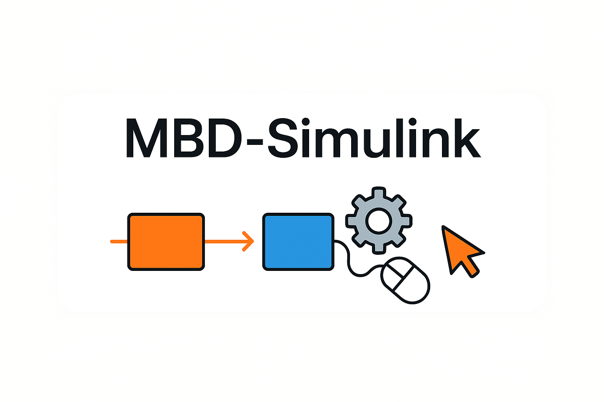
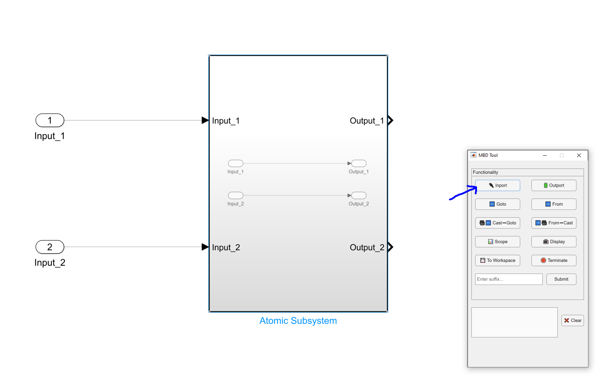
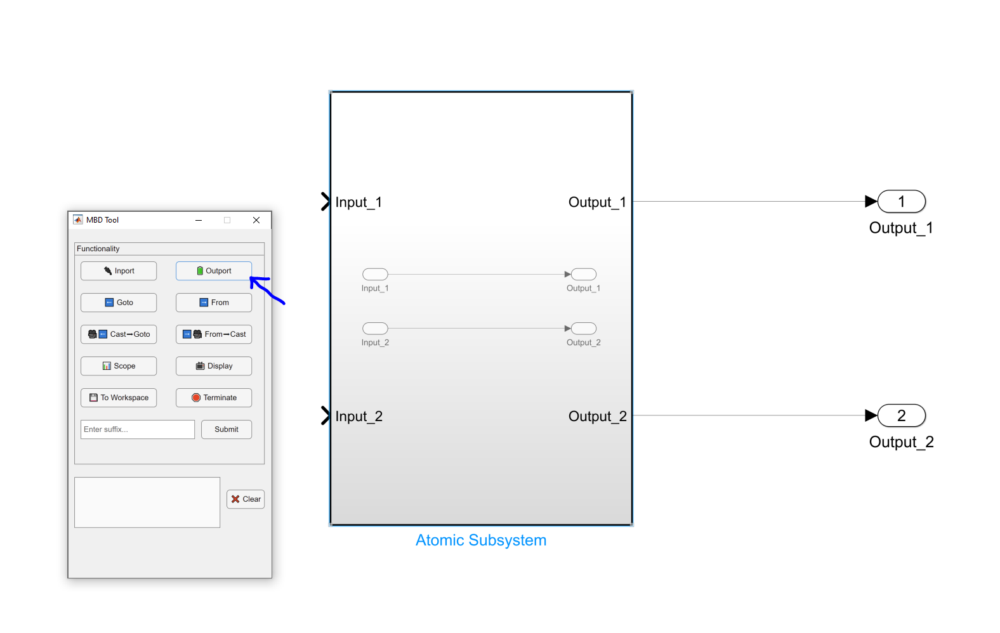
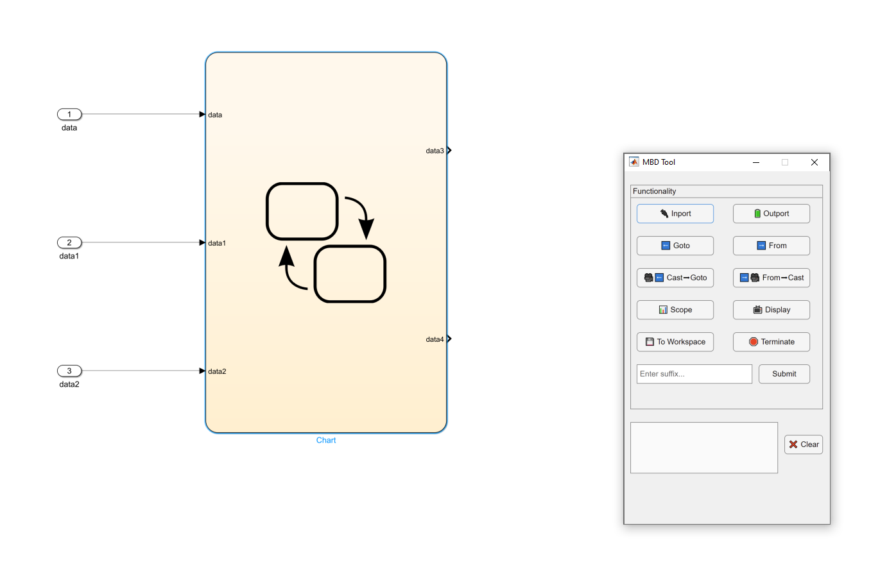
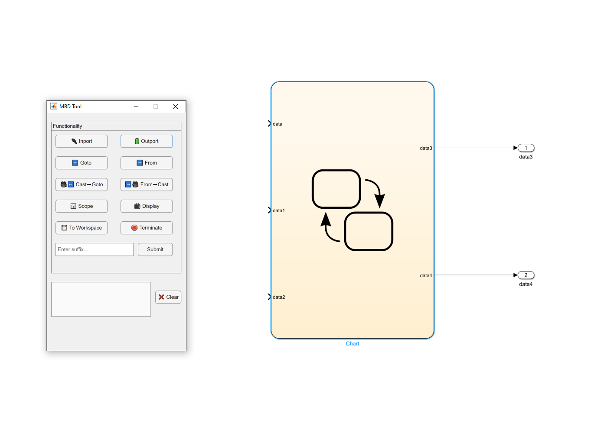
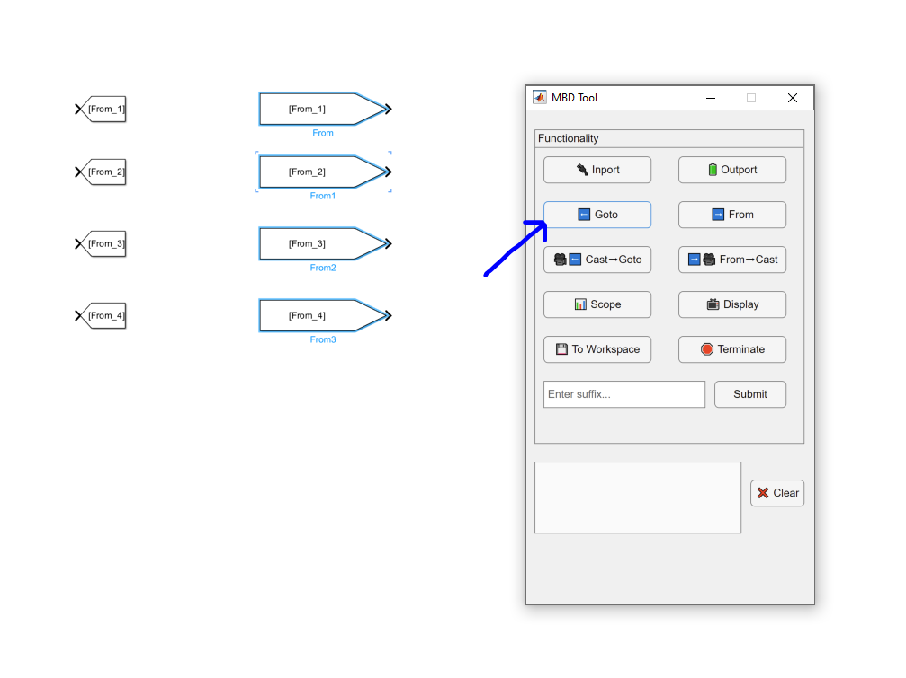
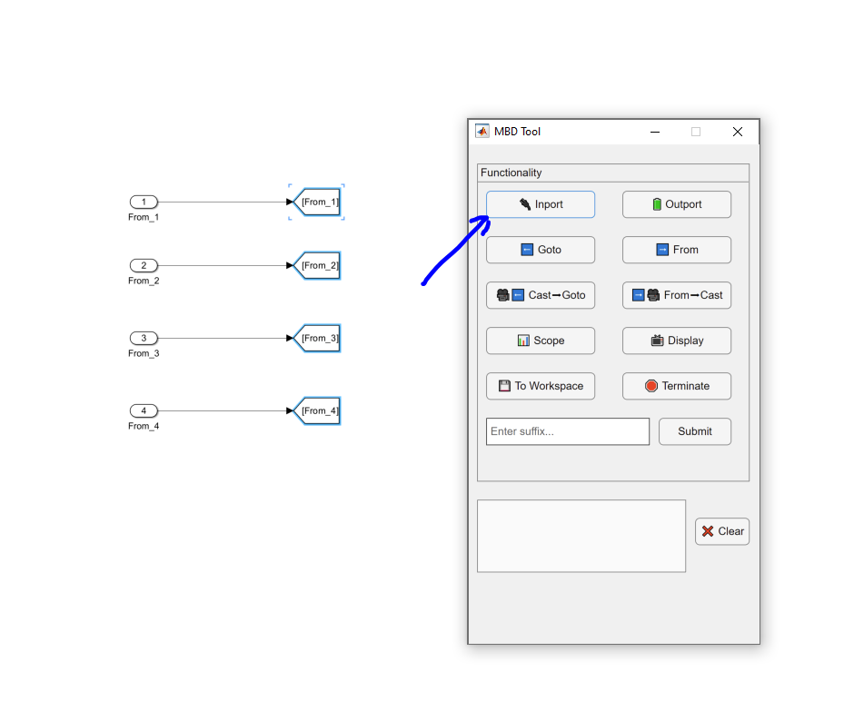

  

<h1 align="center">MBD-Simulink</h1>

  A lightweight tool to accelerate Model-Based Design (MBD) in Simulink by automating repetitive tasks such as block insertion, naming, and connection — all with a single click.

  
  
  

---

## Overview

**MBD-Simulink** streamlines your model-based development workflow by automating common Simulink modeling actions. This tool lets you insert, name, and connect multiple blocks with a single click — helping you build large models more efficiently.

---

## Usage

Just select the Simulink block(s) and apply your desired action.

---

### Example: Adding Inputs/Outputs to a Subsystem

<table>
  <tr>
    <td></td>
    <td></td>
  </tr>
  <tr>
    <td></td>
    <td></td>
  </tr>
</table>

---

### Example: Adding a Chain of Blocks to Interface with a Subsystem

<table>
  <tr>
    <td></td>
    <td></td>
    <td></td>
  </tr>
</table>

---

## Contribution

Contributions are welcome! If you encounter issues or have ideas for improvement, feel free to open an issue or submit a pull request.

---

## License

This project is licensed under the **MIT License**. See the [LICENSE](LICENSE) file for details.
